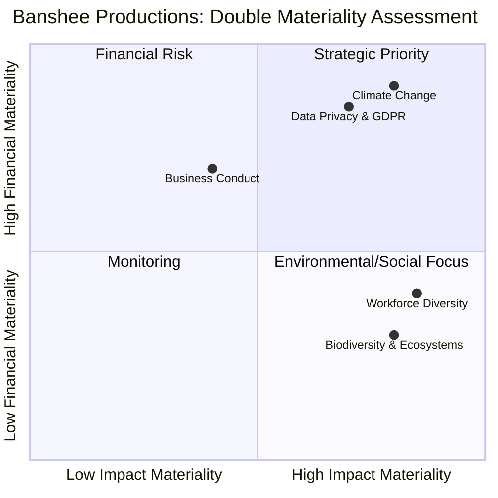

### 📊 Materiality Assessment Data Table

| ESG Topic | Impact Materiality | Financial Materiality | Core Regulatory Driver |
| :--- | :---: | :---: | :--- |
| **Climate Change** | High | High | Mandatory disclosure under CSRD/ESRS; vital for 2030 green capital access. |
| **Data Privacy & GDPR** | High | High | Strains the data minimization mandate; carries extreme risk of structural penalties. |
| **Business Conduct** | Low | High | Mitigates corporate greenwashing risks and secures market competitiveness. |
| **Workforce Diversity** | High | Medium | Aligns with the European Pillar of Social Rights for creative talent management. |
| **Biodiversity & Ecosystems** | High | Low | Addresses EU Taxonomy objectives but represents negligible direct operational risk. |
